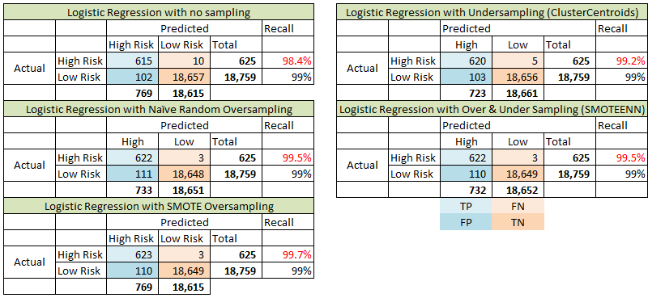
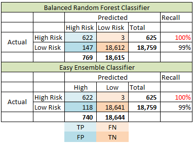

# Risky Business

## Background

Mortgages, student and auto loans, and debt consolidation are just a few examples of credit and loans that people seek online. Peer-to-peer lending services such as Loans Canada and Mogo let investors loan people money without using a bank. However, because investors always want to mitigate risk, a client has asked that you help them predict credit risk with machine learning techniques.

In this assignment I have built and evaluated several machine learning models to predict credit risk using data typical from peer-to-peer lending services. Credit risk is an inherently imbalanced classification problem (the number of good loans is much larger than the number of at-risk loans), so I employed different techniques for training and evaluating models with imbalanced classes. I used the imbalanced-learn and Scikit-learn libraries to build and evaluate models using the two following techniques:

1. [Resampling](#Resampling)
2. [Ensemble Learning](#Ensemble-Learning)

- - -

### Files

[Resampling Starter Notebook](Starter_Code/credit_risk_resampling.ipynb)

[Ensemble Starter Notebook](Starter_Code/credit_risk_ensemble.ipynb)

[Lending Club Loans Data](Instructions/Resources/LoanStats_2019Q1.csv.zip)

- - -

### Instructions

#### Resampling

The imbalanced learn library was used to resample the LendingClub data and build and evaluate logistic regression classifiers using the resampled data. 

Following three resampling techniques were deployed post scaling the data:

1. Oversample the data using the `Naive Random Oversampler` and `SMOTE` algorithms.

2. Undersample the data using the `Cluster Centroids` algorithm.

3. Over- and undersample using a combination `SMOTEENN` algorithm.

Each of the above resampled data was then used to evaluate logistic regression model by following process:

1. Train a `logistic regression classifier` from `sklearn.linear_model`.

2. Calculate the `balanced accuracy score` from `sklearn.metrics`.

3. Calculate the `confusion matrix` from `sklearn.metrics`.

4. Print the `imbalanced classification report` from `imblearn.metrics`.

Based on below model results, I have determined the responses to below questions as outlined:

<b> * Which model had the best balanced accuracy score? </b> 

Naïve Random Oversampling and Over and Under Sampling (SMOTEENN) had the best balanced accuracy score each at 99.47%. The balanced accuracy score for Naïve Random Oversampling is 99.46% while for Undersampling is 99.33%. Accuracy Score depicts how often a model is correct - the ratio of correctly predicted observations to the total number of observations. Hence, Naïve Random Oversampling and Over and Under Sampling (SMOTEENN) are better performing models.

<b> * Which model had the best recall score? </b> 

Logistic Regression with SMOTE Oversampling is the best model with recall score of 99.7% which implies that most of the high risk loans are correctly classified as high risk. There are only 3 loans which are actually high risk and classifed by both the models as low risk.This is followed by Logistic Regression with Naïve Random Oversampling and with Over & Under Sampling (SMOTEENN) models scored at 99.5%. Model Logistic Regression with Undersampling (ClusterCentroids) has performed the least in terms of recall score.

>

<b> * Which model had the best geometric mean score? </b> 

All the models have scored same on the geometric mean score. 
Overall, logistic regression with under sampling is a laggard with respect to others.

    
#### Ensemble Learning

In this section, I have trained and compared two different ensemble classifiers to predict loan risk and evaluate each model. This is done by utilizing Balanced Random Forest Classifier and the Easy Ensemble Classifier. 

Following steps were undertaken for each model post scaling the data:

1. Train the model using the quarterly data from LendingClub provided in the `Resource` folder.

2. Calculate the balanced accuracy score from `sklearn.metrics`.

3. Print the confusion matrix from `sklearn.metrics`.

4. Generate a classification report using the `imbalanced_classification_report` from imbalanced learn.

5. For the balanced random forest classifier only, print the feature importance sorted in descending order (most important feature to least important) along with the feature score.

Based on below model results, I have answered the following questions:

<b> * Which model had the best balanced accuracy score? </b>
        
The Easy Ensemble Classifier model has balanced accuracy score of 99.45% while Balanced Random Forest Classifier has 99.37%. Accuracy Score depicts how often a model is correct - the ratio of correctly predicted observations to the total number of observations. Hence Ensemble Classifier model is better.

<b> * Which model had the best recall score? </b>

Both the models have the same recall scores of nearly 100% which implies that most of the high risk loans are correctly classified as high risk. There are only 3 loans which are actually high risk and classifed by both the models as low risk.

<b> * Which model had the best geometric mean score? </b>

Both the models perform equal in terms of geometric mean score.

<b> * What are the top three features? </b>

Top three features of importance are Borrower's Income, Interest Rate and Debt to Income Ratio which contributes nearly 60% towards an outcome/decision on a loan status. Additionaly, total debt and loan size are factors covering another 29%. Rest of the factors are not as important when coming to decide if a loan is low risk or high.
- - -
